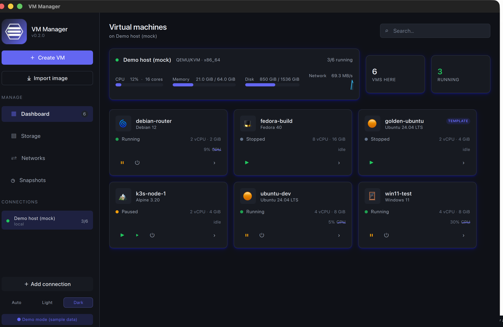
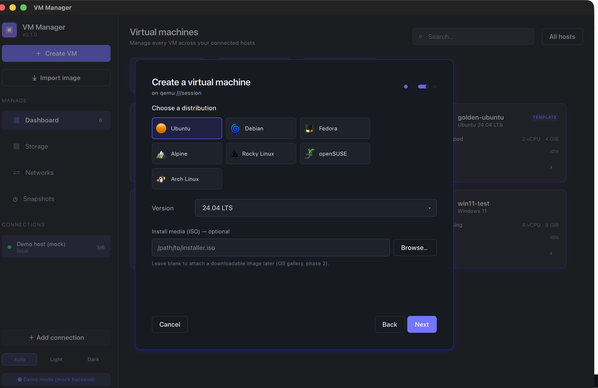
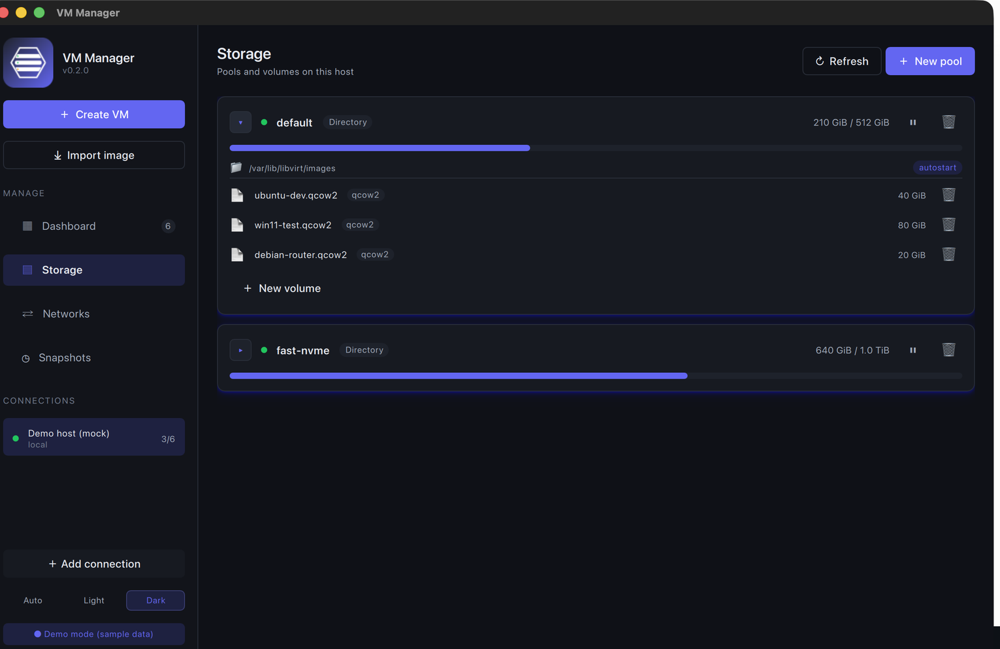

# VM Manager

> A modern, cross-platform virtual-machine manager with feature parity to
> [virt-manager](https://github.com/virt-manager/virt-manager), a fluid modern
> interface, and native builds for **macOS, Windows and Linux**.

VM Manager is a native desktop application built with **Qt 6 / Qt Quick (QML)**
and **C++20**, talking to hypervisors through **libvirt** — locally and over
SSH/TLS to remote KVM/QEMU hosts. It targets homelab & desktop power users and
sysadmins managing fleets of VMs alike.



<p align="center">
  
  
</p>

See [`ROADMAP.md`](ROADMAP.md) for the phased plan and
[`ARCHITECTURE.md`](ARCHITECTURE.md) for how it fits together.

---

## Features

- **Multi-host dashboard** — every VM across every connected host in one gallery,
  with colored run-state, per-VM CPU/mem sparklines, and a live host-resource
  card (CPU · memory · disk pools · network graph).
- **VM lifecycle** — start, shut down, force-off, pause, resume, reboot, delete
  (with optional disk cleanup), autostart.
- **Create-VM wizard** — guided *Windows / Linux / Custom* flow with distro +
  version selection, editable resource fields, and **OS-aware hardware**
  (Windows → UEFI + TPM 2.0 + Secure Boot; Linux → virtio). Optional
  **cloud-init** seeding (hostname / user / SSH key).
- **Cross-format import** — `.qcow2`, `.raw`, `.vmdk`, `.vhdx`, `.vhd`, `.vdi`,
  `.qed`, and `.ova` / `.ovf` appliances are converted (via `qemu-img`) and
  registered.
- **Storage** — manage pools (create, adopt a folder, start/stop, delete) and
  volumes (create, resize, delete); attach/detach disks to a VM.
- **Networking** — create NAT / isolated / bridged virtual networks; start,
  stop and delete them.
- **Snapshots** — take, restore and delete, plus an automatic **scheduler** with
  retention (keep newest N).
- **Templates & cloning** — mark a VM as a template; full and linked clones.
- **Consoles** — open a VM's graphical console in your system viewer (with
  automatic **SSH tunnelling** for remote hosts).
- **Connections** — local `qemu:///…` and remote `qemu+ssh://` / `qemu+libssh2://`
  (SSH key **or** password), with connect / disconnect / remove.
- **Themeable** — light / dark / follow-system, with a clean design-token system.

Runs against a built-in **mock backend** (`VMM_BACKEND=mock`) so the whole UI can
be explored on any machine — no hypervisor required.

Status of each item is tracked in [`ROADMAP.md`](ROADMAP.md).

---

## Install

Grab a build for your OS from the
[**Releases**](https://github.com/michiel-zededa/vm-manager/releases) page
(`.dmg` / `.zip` / `.tar.gz`). The macOS and Windows builds bundle the Qt
runtime. To manage **real** VMs you need `libvirt` + `qemu` on the host you
connect to.

> Downloaded binaries are currently built without the libvirt client; to drive
> real VMs today, build from source with `pkg-config` + `libvirt` present (see
> below). A self-contained libvirt bundle is on the roadmap.

---

## Building

Full per-platform instructions live in [`BUILDING.md`](BUILDING.md). macOS:

```bash
brew install qt cmake ninja pkg-config     # pkg-config is required to detect libvirt
brew install libvirt qemu                  # enables the real backend + import

cmake -S . -B build -G Ninja -DCMAKE_BUILD_TYPE=Release -DCMAKE_PREFIX_PATH="$(brew --prefix qt)"
cmake --build build --parallel
open ./build/vm-manager.app                # or: VMM_BACKEND=mock ./build/vm-manager.app/Contents/MacOS/vm-manager
```

Requirements: **Qt 6.5+**, **CMake 3.21+**, a **C++20** compiler, and
**pkg-config** + **libvirt** for the real backend (auto-detected; without them
the app runs against the mock backend).

---

## Design principles

1. **The UI never blocks.** All hypervisor calls run off the GUI thread.
2. **The UI is decoupled from libvirt.** Everything speaks to
   `IHypervisorBackend`, so the app runs against a mock and stays testable.
3. **Progressive disclosure.** Simple by default, with an *Advanced* path.
4. **Native, small, fast.** One self-contained installer per OS.

---

## License

[MIT](LICENSE).
</content>
